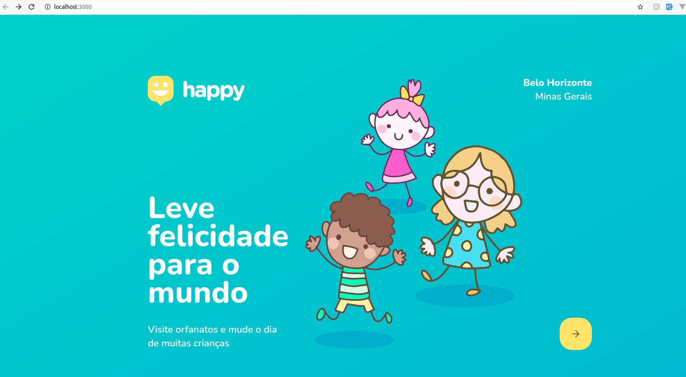
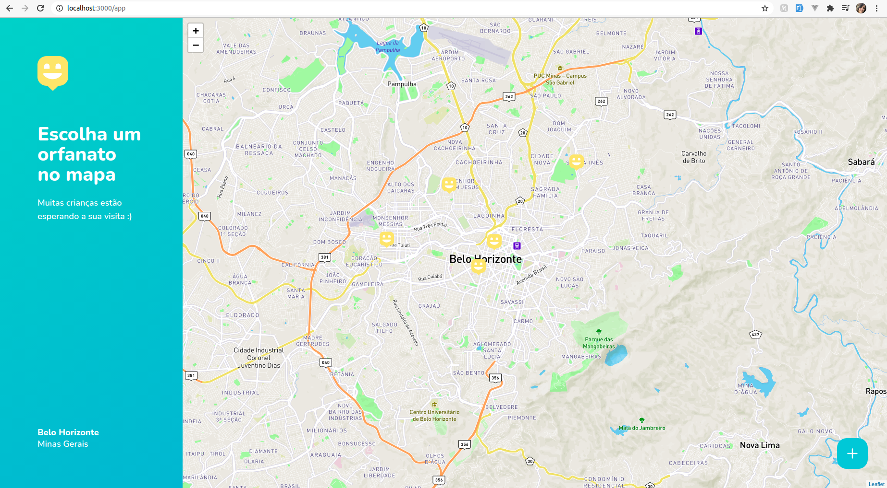
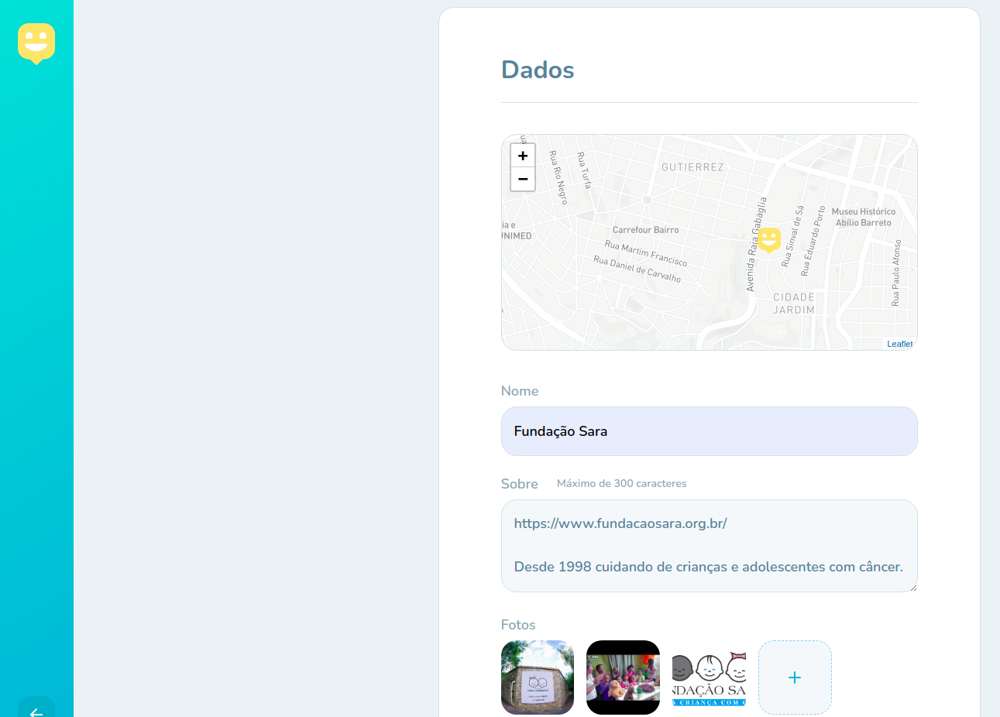
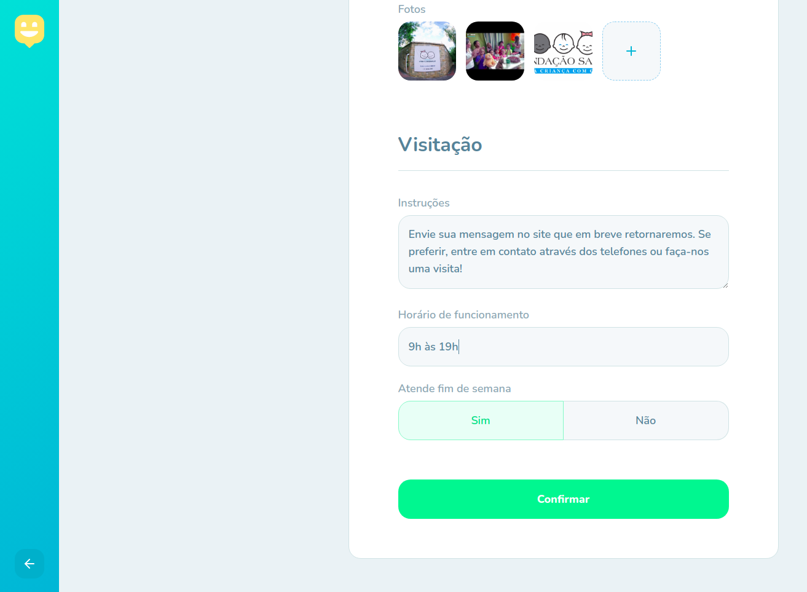
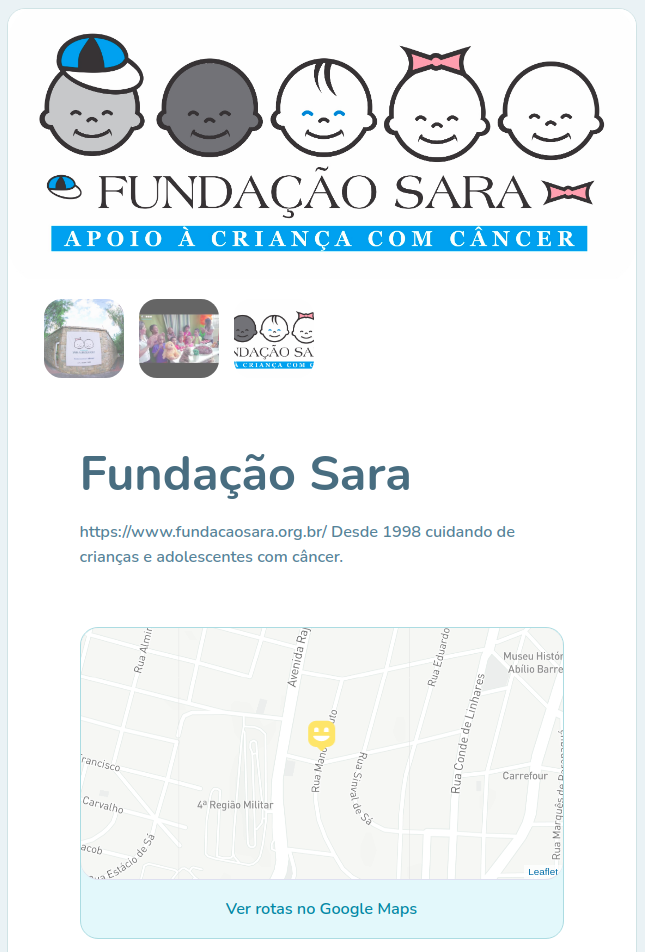
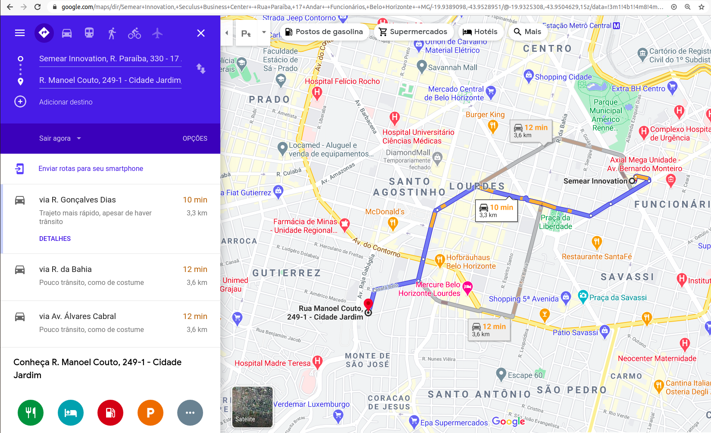

## nlw3
Permite cadastrar orfanatos com fotos e localização e exibe os orfanatos no mapa.
Feito com React.

## Instalação

Instale o yarn
```shell script
sudo apt update
sudo apt install yarn
```
O comando acima irá instalar também o Node.js. Se você já tem o Node.js instalado, execute:
```shell script
sudo apt update
sudo apt install --no-install-recommends yarn
```
Clone o projeto
```shell script
git clone https://github.com/iasmini/nlw3.git
```

Entre na pasta raiz/web e instale as dependências:
```shell script
$nlw/web yarn install
```

Entre na pasta raiz/backend e instale as dependências:
```shell script
$nlw/backend yarn install
```
Para a exibição do mapa você deve ter uma conta e um token no serviço: [Mapbox](https://account.mapbox.com/).  
Crie uma cópia do arquivo [.env.sample](web/.env.sample) e renomeie para .env deixando dentro do mesmo diretório.
Nesse arquivo você deve inserir seu token do Mapbox.

Inicie o backend e o frontend em terminais diferentes:
```shell script
$nlw/backend yarn dev
$nlw/web yarn start
```

A aplicação estará disponível em: [http://localhost:3000/](http://localhost:3000/)

## Imagens
### Tela inicial

### Mapa com os orfanatos cadastrados

### Cadastro de um novo orfanato



### Detalhes do orfanato cadastrado

### Permite traçar a rota no Google Maps

